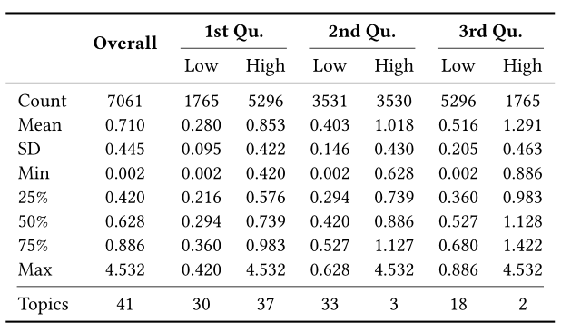
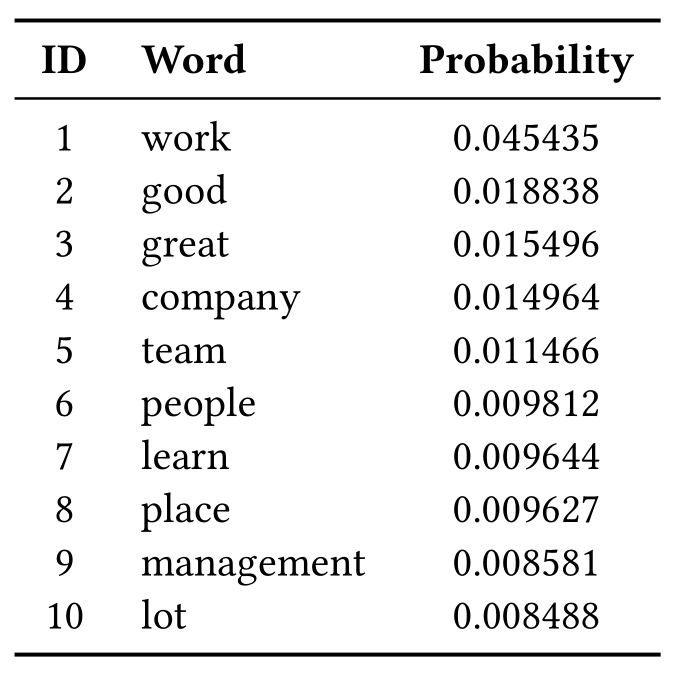
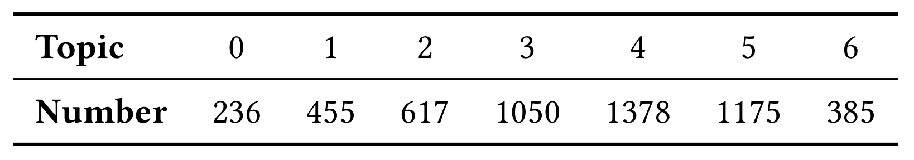
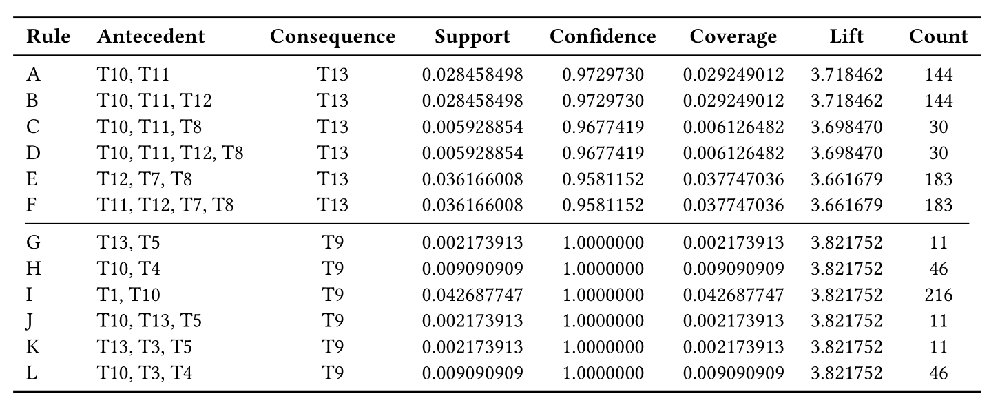
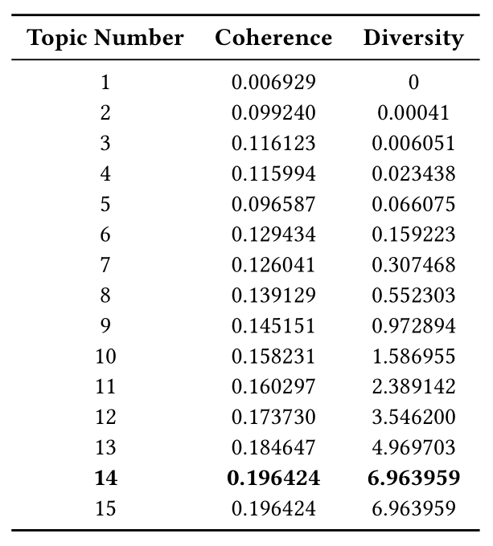
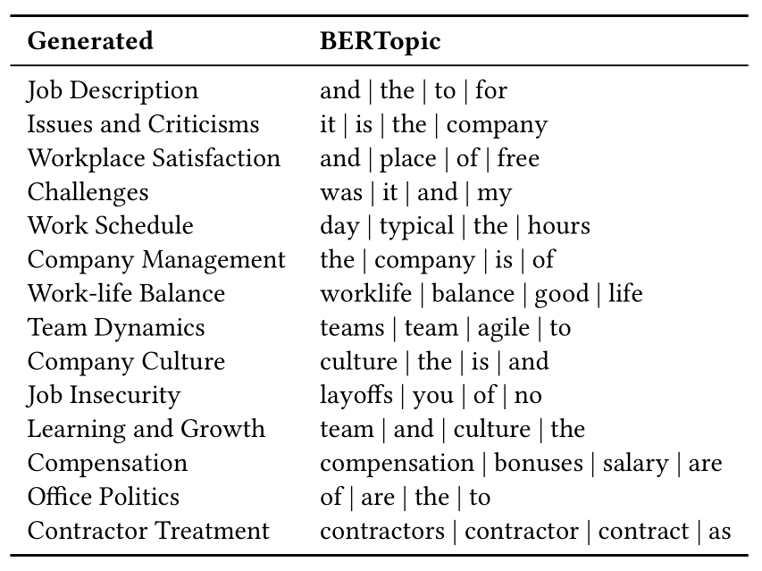
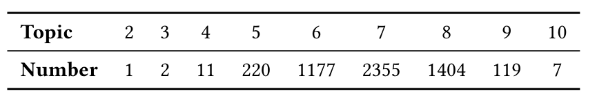
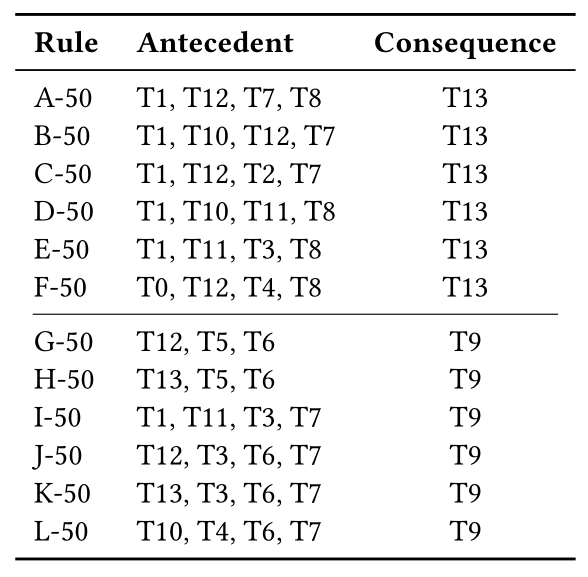

# Interpreting Multi-Topic Modeling via Association Rules

This repo contains collected review dataset and implementation for multi-topic modeling and reasoning details.

## Data

The wealth of online review data has become the source of a number of recommender services that help people collect information quickly and make decisions. Comprehending the recurrent common topics underscores the shared concerns that emerge from diverse perspectives. We collected company review dataset from [Indeed.com](https://indeed.com/) to illustrate our method could bring more insights about online review data comprehension.

 
 

## Three-stage multi-topic modeling and reasoning method

We propose a new multi-topic modeling and reasoning method that uses information theory, generative models, and association rules to identify and interpret topics with high-level labels.

 
 

**Stage 1: Complexity inspection**

We calculate entropy for the overall corpus and by different entropy quantiles as follows:

 

The top 10 words with the highest probability tend to have less information in a company context.

 

Reviews with low entropy are characterized by a relatively focused topic and shorter length, as exemplified by the following example with an entropy value at the mean of the first quantile:

*"Pros: There are lots of opportunity to connect with others on different teams if you want to move around. Cons: Teams are global and sometimes hard to reach." (Entropy: 0.284)*

Reviews with higher entropy, on the other hand, tend to contain a greater amount of information, making it more difficult to distill an overall topic into a single label. An example review, with an entropy value at the mean of the third quantile, is as follows:

*"Projects in [Company] are very poor and management does not have a clue in what they are doing in some projects. Pros: Good leave policies; Flexible work; Good work life. Cons: Projects are poor; Not very good management in some project level." (Entropy: 0.541)*

For the following analysis, we used the first quantile (0.420) as the threshold to partition the corpus into a low- and a high-entropy two dataset to conduct stage 2 and stage 3 analyses, respectively.

**Stage 2: Single-topic discovery**

After partitioning the corpus into low- and high-entropy parts based on entropy, we identified 14 topics that have been mainly discussed on this website based on low-entropy data.

 
 

 **Stage 3: Multi-topic logic rule reasoning**

 By calculating the distances to fitted topic clusters for high-entropy data, we assign multiple topics based on the first distance quantile, resulting in the following topic distribution:

 
 

 Of the 14 topics that were identified, 385 reviews were assigned to six topics. The example below demonstrates that distance metrics can effectively capture the semantic meanings of these reviews.

 *"[Company] was a wonderful place to work at.(**Workplace Satisfaction**) A typical day consisted of reviewing on going bugs and delivering ways to fix them, as well as committing change lists to improve any systems/applications that were launched in Borg.(**Work schedule, Job Description**) I learned a lot on how [Company] executes business practices in fluid and collaborative ways without getting bogged down in paperwork. The Management Team is highly technical, they could provide feedback for challenging solutions and guidance on how to wrangle them.(**Company management**) [Company]’s workplace culture is collaborative but highly competitive, you always need to bring you "A" game on a daily basis.(**Issues and Criticisms**) The hardest part of the job was trying to manage work life, as the demands for getting projects completed on time were paramount.(**Work-life balance**) My fondest memories for working at [Company] were the SRE members in the flights team. These members were a great bunch to work with."*

Assigning possibly multiple topics to high-entropy data allows us to stimulate association rules among them. We take the two most negative topics (i.e., those with the lowest average ratings) as the consequences, and the first six logical rules for each topic, sorted by confidence in descending order, are presented below.

 
 

Upon visualizing the association rules, we have noticed that the least satisfying two topics (marked in red) are driven by the most positive perspective in the workplace (marked in green).

 
 

 **Ablation Study**

1. Single-topic evaluation

    Although the baseline model BERTopic has downward compatibility in terms of altering the number of topics, the quality of clustering results cannot be guaranteed.

    
 

    In terms of topic representation, generating keyword labels through a LLM from a randomly sampled subset of topic reviews can provide a meaningful and high-level summary of topics.

    
 

 2. Multi-topic threshold effect

    Assigning multiple topics to high-entropy data by using the second distance quantile will result in more rules with more details.

    
 

    
 

