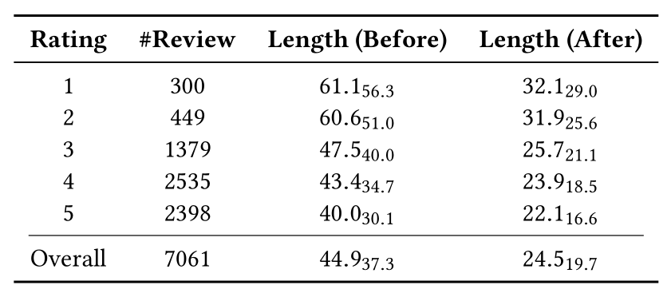
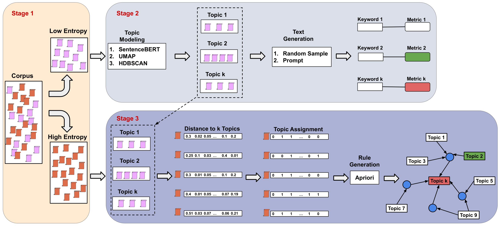
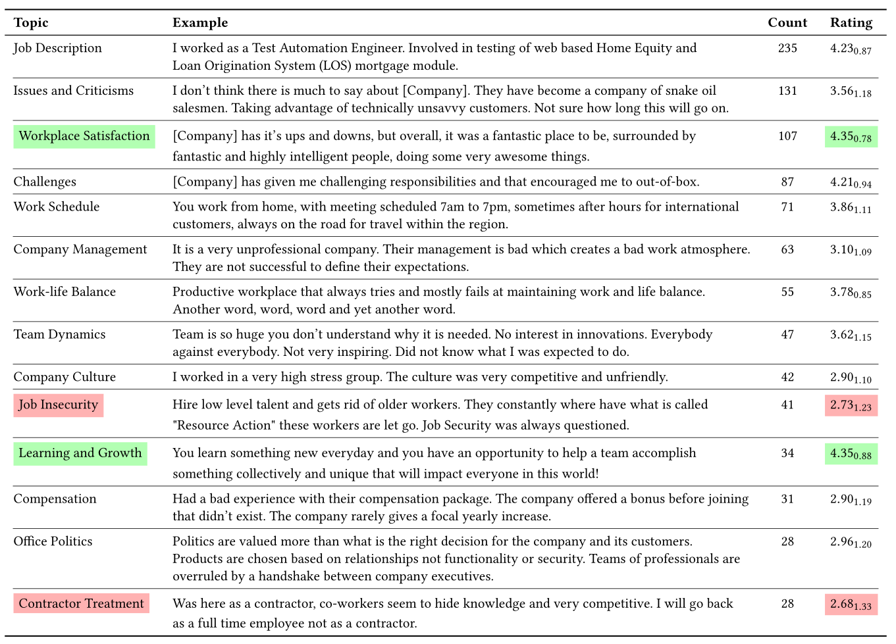
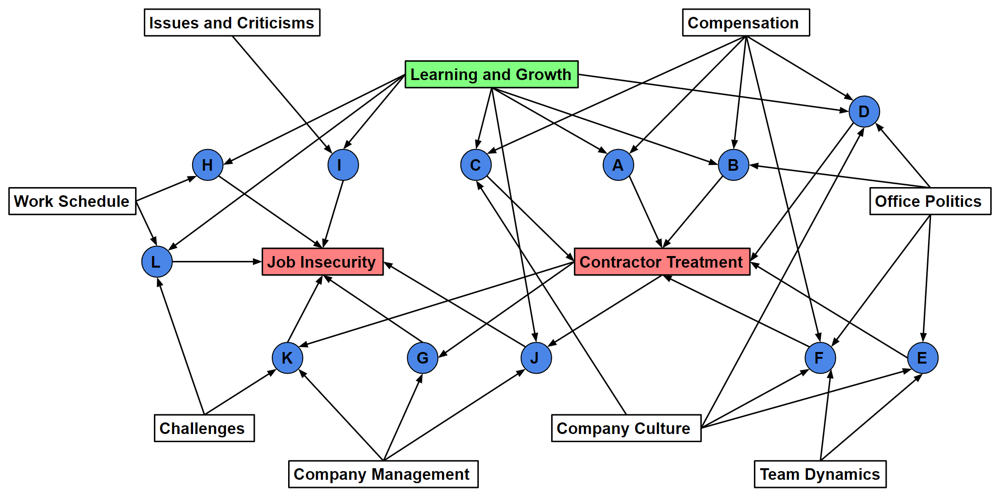

# Interpreting Multi-Topic Modeling via Association Rules

This repo contains collected review dataset and implementation for multi-topic modeling and reasoning details.

## Data

The wealth of online review data has become the source of a number of recommender services that help people collect information quickly and make decisions. Comprehending the recurrent common topics underscores the shared concerns that emerge from diverse perspectives. We collected company review dataset from [Indeed.com](https://indeed.com/) to illustrate our method could bring more insights about online review data comprehension.

 
 

## Three-stage multi-topic modeling and reasoning method

1. We propose a new multi-topic modeling and reasoning method that uses information theory, generative models, and association rules to identify and interpret topics with high-level labels.

 
 

2. After partitioning the corpus into low- and high-entropy parts based on entropy, we identified 14 topics that have been mainly discussed on this website based on low-entropy data.

 
 

3. Assigning possibly multiple topics to high-entropy data allows us to stimulate association rules among them, where the least satisfying two topics (marked in red) are driven by the most positive perspective in the workplace (marked in green).

 
 

